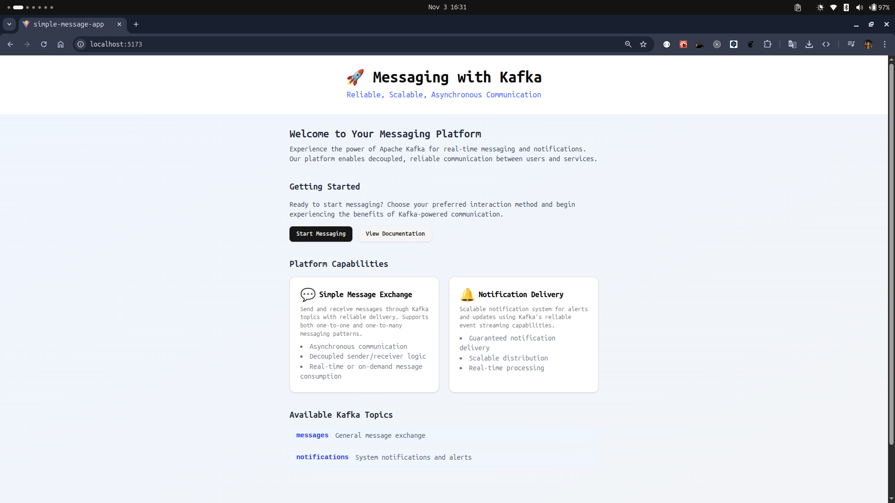
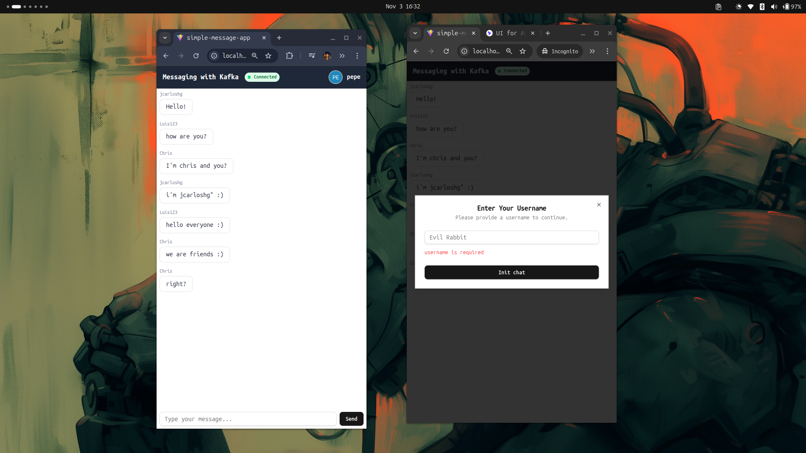

# 🏛️ Messaging with Kafka

A full-stack, event-driven messaging architecture using **Kafka**, **Node.js**, **React**, and **PostgreSQL**. This project demonstrates real-time chat and message exchange with domain-driven design, modular layers, and modern technologies.

## 📚 Table of Contents

1. Project Overview
2. Architecture
3. Key Features
4. Implementation Use Cases
5. Technologies Used
6. Folder Structure
7. Setup & Getting Started
8. API Endpoints & Events
9. Screenshots

## 📝 Project Overview

This repository implements a scalable messaging system with:

- Real-time chat and message exchange
- Kafka for event streaming and asynchronous communication
- Domain-Driven Design for maintainable code
- REST API and Socket.IO for frontend-backend interaction
- PostgreSQL for message persistence

## 🏗️ Architecture

```
Frontend (React + Vite + Socket.IO)
   |         ^
   v         |
Backend (Node.js + Express + KafkaJS)
   |         ^
   v         |
Kafka Broker <-> PostgreSQL
```

- **Frontend**: Sends/receives messages via REST and sockets
- **Backend**: Orchestrates commands, events, and persistence
- **Kafka**: Event bus for message exchange and chat
- **Database**: Stores chat history and messages

### 🐳 Docker Services

This project uses Docker Compose to orchestrate the following services:

| Service      | Description                                                                                 | Ports |
| ------------ | ------------------------------------------------------------------------------------------- | ----- |
| **db**       | PostgreSQL database for message persistence. Initializes with user, password, and database. | 5432  |
| **broker**   | Apache Kafka broker for event streaming and asynchronous communication.                     | 9092  |
| **kafka-ui** | Kafka UI for monitoring and managing Kafka topics and messages.                             | 8080  |
| **back**     | Backend service (Node.js, Express, KafkaJS) handling API, events, and persistence.          | 8000  |
| **front**    | Frontend service (React, Vite) for chat UI and user interaction.                            | 5173  |

#### Service Details

- **db**: Runs PostgreSQL with persistent storage. Environment variables set up the database, user, and password.
- **broker**: Runs Kafka in KRaft mode (no Zookeeper), exposes listeners for internal and external communication.
- **kafka-ui**: Provides a web interface to inspect Kafka clusters, topics, and messages.
- **back**: Backend API and event orchestrator. Connects to PostgreSQL and Kafka, exposes REST and Socket.IO endpoints.
- **front**: React-based frontend for chat and messaging, connects to backend via REST and sockets.

All services are defined in [`docker-compose.yml`](./docker-compose.yml) and can be started together for local development and testing.

## 🚀 Key Features

- 💬 Chat Functionality: Real-time chat, message list, input forms, user management
- 🔄 Message Exchange: Asynchronous messaging with domain-driven design
- 🧩 Socket Integration: Real-time communication via Socket.IO
- 🌐 API Communication: RESTful endpoints using Axios
- 🧱 Reusable UI Components: Modular, customizable React components

## 🚦 Implementation Use Cases

### 1. 💬 Simple Message Exchange

**Backend:**

- Application Layer: Orchestrates message sending, event publishing, and domain logic
- Domain Layer: Defines commands, use cases, domain events, and entities
- Infrastructure Layer: Integrates Kafka (event bus, publisher) and sockets
- Workflow:
  1. Sender issues a command to send a message
  2. Application layer validates and invokes domain use case
  3. Use case creates message entity and triggers domain event
  # 🏛️ Messaging with Kafka
  5. Event handlers notify recipients, persist message, and deliver via sockets

**Frontend:**

- Domain Layer: Message types and validation (Zod)
- Application Layer: Orchestrates message exchange, validates input, executes use case
- Use Case: Validates business rules, sends messages via repository
- Infrastructure Layer: Axios-based repository for backend API, socket service for real-time updates
- Workflow:
  1. Sender publishes message via frontend form
  2. Message validated and sent through layers
  3. Receiver subscribes to topic and receives messages in real time or on demand

### 2. 📖 Chat Message Reading

**Backend:**

- Application Layer: Orchestrates reading chat messages from database
- Domain Layer: Message entity, use case for reading messages 4. Messages returned to consumer

**Frontend:**

- Domain Layer: Message type for chat
- Application Layer: Orchestrates reading messages, executes use case
- Use Case: Retrieves messages from repository, maps to domain objects
- Infrastructure Layer: Axios for API, socket service for real-time updates
- Workflow:
  1. Producer publishes chat messages to Kafka
  2. Consumer subscribes via sockets/API, displays messages in real time or on demand

## 🛠️ Technologies Used

- Vite
- 🎨 Tailwind CSS
- 🦄 KafkaJS
- 🟣 Socket.IO
- 🌐 Axios
- 🧬 Zod
- 🧱 Radix UI
- 🧪 Jest
- 📦 Lucide React
- 📦 Class Variance Authority
- 📦 Yup
- 🟫 Express
- 🔵 PostgreSQL
- 🔷 Sequelize
- 🟩 Nodemon

```
root/
├── back/         # Backend (Node.js, Kafka, Express, PostgreSQL)
│   ├── src/
│   │   ├── app/
├── db/           # Database scripts, migrations, pgadmin
├── documentation/# Docs and guides
├── front/        # Frontend (React, Vite, Tailwind)
│   ├── src/
│   │   ├── app/
│   │   ├── application/
│   │   ├── assets/
```

## 🚀 Setup & Getting Started

### 1. Install dependencies

```zsh
npm install
npm test
```

### 3. Start services (Docker Compose)

```zsh
docker-compose up --build
```

**Base Path:** `/api/messages`

| Method | Path | Description |
| | | - |
| GET | /health | Health check for messages service |
| POST | / | Send a new message |

**Request Body:**

````json
[
  {
    "messageId": "string",
    "senderId": "string",
    "content": "string",
    "timestamp": "ISO8601"
  }
]
````

#### GET /api/messages/health

Health check endpoint. Returns a simple status message.

### Socket.IO Events

| Event Name | Description |
| | - |
| chat-message | Broadcasts a new chat message to clients |

**Payload Example:**

```json
{
  "payload": {
    "messageId": "string",
    "senderId": "string",
    "content": "string",
    "timestamp": "ISO8601"
  }
}
```

## 🖼️ Screenshots




<video controls src="documentation/WhatsApp Video 2025-11-03 at 3.05.55 PM.mp4" title="testing"></video>
<video controls src="documentation/Screencast from 2025-11-03 15-04-34.mp4" title="View on Kafka UI"></video>

## 🤝 Regards

Thank you for reading! If you have any questions or contributions, feel free to reach out via [LinkedIn](https://www.linkedin.com/in/jose-carlos-huerta-garcia-773952212/).

## 📄 License

This project is licensed under the MIT License.
